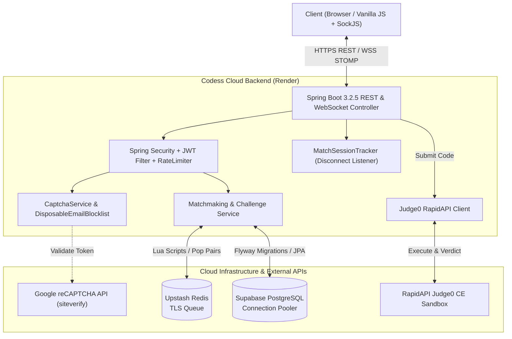

# ⚔️ Codess — Real-Time 1v1 Competitive Coding Arena

<p align="center">
  
</p>

<p align="center">
  <strong>Fast-paced, real-time 1v1 multiplayer competitive coding battleground with live code evaluation, Elo ratings, anti-cheat detection, bot protection, and friend challenges.</strong>
</p>

<p align="center">
  <a href="https://coding-arena-phi.vercel.app"></a>
  <a href="https://codess-8rrg.onrender.com"></a>
  
  
  
  
  
  
</p>

---

## 📌 Table of Contents
- [📖 Overview](#-overview)
- [✨ Key Features](#-key-features)
- [🏗️ System Architecture](#️-system-architecture)
- [🛠️ Tech Stack](#️-tech-stack)
- [🗄️ Database & Schema Migrations](#️-database--schema-migrations)
- [📡 API & WebSocket Specification](#-api--websocket-specification)
- [🛡️ Security & Anti-Cheat Protection](#️-security--anti-cheat-protection)
- [🚀 Quickstart & Local Setup](#-quickstart--local-setup)
- [🌐 Cloud Deployment](#-cloud-deployment)
- [👥 Credits & Core Authors](#-credits--core-authors)
- [📄 License](#-license)

---

## 📖 Overview

**Codess** is a gamified, real-time competitive programming platform where developers go head-to-head in speed coding battles. 

Players can enter a quick-match matchmaking queue or challenge their friends directly in private duels. The platform automatically evaluates code submissions across multiple languages (Python, Java, C++, JavaScript) via **Judge0**, applies dynamic **Elo rating calculations**, prevents cheating through **active tab monitoring and auto-forfeit**, safeguards against bot accounts using **Google reCAPTCHA v2 and disposable email blocking**, and synchronizes live match events via **WebSockets (STOMP)**.

---

## ✨ Key Features

- ⚡ **Atomic Redis Matchmaking**: Sub-millisecond queue management powered by atomic Redis Lua scripts that pair players within tight Elo rating windows.
- ⚔️ **Social Hub & Friend Duels**: Add friends, track online activity, and challenge friends to private battles with real-time invitation modals.
- 💻 **Live Code Execution (Judge0 CE)**: Multi-language code evaluation with real-time feedback for compilation errors, runtime errors, and sample/hidden test cases.
- 🤖 **Bot & Sybil Defense**: Google reCAPTCHA v2 registration verification and real-time disposable email blocklist (`mailinator.com`, `10minutemail.com`, etc.).
- 🛡️ **Anti-Cheat & Tab-Switch Forfeit**: Automatic match forfeit mechanism detecting browser tab switches and window defocus during ranked battles.
- 🚪 **Disconnect & Forfeit Victory Engine**: If a player leaves, closes their tab, or disconnects, an auto-forfeit occurs after a 6-second grace period, instantly awarding the win and Elo rating to the opponent.
- 🔒 **URL Privacy & Clean Navigation**: Match state is stored securely in private `sessionStorage` rather than visible URL parameters (`match.html` with clean URLs). Direct visits without a match ID redirect cleanly to the dashboard.
- 📈 **Dynamic Elo Rating Engine**: Accurate Elo rating updates upon match completion with transparent rating deltas (+16 / -16) and streak tracking.
- 🎭 **Customizable 3D & 2D Character Avatars**: Pick custom character avatars saved directly to your profile and reflected across all screens.
- ⏱️ **Active Match Expiry Engine**: Background scheduler that automatically expires abandoned matches without corrupting player ratings.
- 🚦 **Token Bucket Rate Limiting (Bucket4j)**: Strict IP and user-based rate limiting to prevent brute-force attacks and queue flooding.

---

## 🏗️ System Architecture



---

## 🛠️ Tech Stack

### Backend
- **Framework**: Java 17, Spring Boot 3.2.5
- **Security & Bot Protection**: Spring Security 6, BCrypt, JJWT (HS256), Google reCAPTCHA v2 Server Verification
- **Database Access**: Spring Data JPA, Hibernate, Flyway Migrations
- **Real-Time Communication**: Spring WebSocket, STOMP protocol, SockJS fallback, Disconnect Event Listeners
- **Caching & Queue**: Spring Data Redis (Jedis / Lettuce over SSL)
- **Rate Limiting**: Bucket4j In-Memory Token Bucket

### Frontend
- **Interface**: Responsive HTML5, Modern CSS3 variables, Bootstrap 5.3
- **Bot Defense**: Google reCAPTCHA v2 Widget
- **Networking**: Fetch API with automated environment routing and keepalive unload beacons
- **Real-Time Streaming**: `@stomp/stompjs` & `sockjs-client`
- **Avatars**: DiceBear API & Custom 2D Character Assets

### DevOps & Cloud Services
- **Hosting**: Render (Docker containerized) & Vercel (Frontend Static Distribution)
- **Database**: Supabase PostgreSQL (Session Pooler via IPv4)
- **Cache**: Upstash Redis (Serverless TLS)
- **Code Execution**: RapidAPI Judge0 CE

---

## 🗄️ Database & Schema Migrations

Managed with Flyway migrations located at `src/main/resources/db/migration/`:

| Version | Migration File | Description |
|---|---|---|
| **V1** | `V1__initial_schema.sql` | Users, Problems, Test Cases, Matches, Submissions |
| **V2** | `V2__add_match_expires_at.sql` | Match expiration timestamp |
| **V3** | `V3__create_challenges_table.sql` | 1v1 direct friend challenge requests |
| **V4** | `V4__add_wins_losses_and_match_rating_deltas.sql` | Win/Loss stats and match Elo deltas |
| **V5** | `V5__create_profile_preferences_practice_and_friends.sql` | Friendships, Preferences, Practice sessions |
| **V6** | `V6__default_rating_zero.sql` | Default user rating zero initialization |
| **V7** | `V7__add_avatar_seed_to_users.sql` | User character avatar persistence |

---

## 📡 API & WebSocket Specification

### 🔑 Authentication (`/api/auth`)
- `POST /api/auth/register` — Create account with `username`, `email`, `password`, `termsConsent`, and optional `captchaToken`.
- `POST /api/auth/login` — Authenticate and receive a 24h JWT token.
- `GET /api/auth/me` — Retrieve the authenticated player's profile.

### ⚔️ Matchmaking & Challenges (`/api/matchmaking`, `/api/challenges`)
- `POST /api/matchmaking/queue` — Enter the competitive matchmaking pool.
- `DELETE /api/matchmaking/queue` — Leave the matchmaking queue.
- `POST /api/challenges` — Challenge a friend directly by username.
- `POST /api/challenges/{id}/accept` — Accept challenge (creates match & notifies both players).
- `POST /api/challenges/{id}/decline` — Decline incoming challenge.
- `GET /api/challenges/pending` — List pending challenges for the current user.

### 🎮 Match & Submissions (`/api/matches`)
- `GET /api/matches/{id}` — Get match details, problem statement, and sample tests.
- `GET /api/matches/active` — Check if current user has an ongoing match.
- `POST /api/matches/{id}/submissions` — Submit code for judging via Judge0.
- `POST /api/matches/{id}/forfeit` — Forfeit match (triggered on explicit leave, tab switch, or disconnect).

### ⚡ WebSocket (STOMP) Destinations
- **Endpoint**: `/ws` (with SockJS fallback)
- **User Topic (`/topic/user/{userId}`)**: Receives `MATCH_FOUND`, `CHALLENGE_RECEIVED`, and `CHALLENGE_ACCEPTED`.
- **Match Topic (`/topic/match/{matchId}`)**: Receives live `MATCH_START`, submission verdicts, and `MATCH_END` (with forfeit reasons and Elo deltas).

---

## 🛡️ Security & Anti-Cheat Protection

1. **Bot & Disposable Email Defense:**
   - Registration requires completing Google reCAPTCHA v2.
   - Submitted emails are checked against `DisposableEmailBlocklist` containing 17+ disposable domains (`mailinator.com`, `10minutemail.com`, `tempmail.com`, etc.), rejecting fake accounts with HTTP 400.
2. **Tab-Switching & Window Defocus Detection:**
   - The battle client monitors `visibilitychange` and `window.blur` events.
   - If a player attempts to tab out to browse solutions, the anti-cheat listener displays a warning or triggers an immediate forfeit (`POST /api/matches/{id}/forfeit`).
3. **Real-Time Disconnect & Abandon Handling:**
   - The backend `MatchSessionTracker` listens to WebSocket disconnect events.
   - An auto-forfeit task is scheduled with a **6-second grace period** (allowing legitimate page reloads). If the user does not reconnect, they forfeit and the opponent is instantly awarded the win.
   - Frontend triggers `keepalive` fetch beacons on `beforeunload` and `pagehide` ensuring forfeit requests reach the server even during abrupt tab closures.
4. **URL Match ID Privacy:**
   - Players transition into `match.html` using client-side `sessionStorage` rather than visible URL query parameters (`?matchId=...`), protecting active matches from URL shoulder-surfing.
5. **WebSocket Channel Authorization:**
   - Custom `WebSocketSecurityInterceptor` checks JWT identity on every subscription.
   - Players cannot subscribe to unauthorized user queues or opponents' private channels.
6. **Atomic Winner Determination:**
   - Winner assignment uses database-level conditional CAS queries (`WHERE id = ? AND winner_id IS NULL`), making double-winner race conditions mathematically impossible.
7. **Brute Force Defense:**
   - Bucket4j rate limits authentication attempts (5 req/min), code submissions (10 req/min), and queue requests (15 req/min).

---

## 🚀 Quickstart & Local Setup

### 1. Clone the repository
```bash
git clone https://github.com/Souvikkundu0901/coding-arena.git
cd coding-arena
```

### 2. Configure Environment Variables
Create a local run script (`run.ps1` on Windows or `run.sh` on macOS/Linux):
```bash
export DB_HOST="localhost"
export DB_PORT="5432"
export DB_NAME="postgres"
export DB_USERNAME="postgres"
export DB_PASSWORD="your_password"
export REDIS_HOST="localhost"
export REDIS_PORT="6379"
export JWT_SECRET="your-base64-encoded-256-bit-secret-key"
export JUDGE0_URL="https://judge0-ce.p.rapidapi.com"
export JUDGE0_MOCK_MODE="false"
export RAPIDAPI_KEY="your_rapidapi_key"
export RECAPTCHA_SECRET_KEY="" # Optional for local dev; leave empty to bypass
```

### 3. Build & Run Tests
```bash
mvn clean test
```

### 4. Start the Application
```bash
mvn spring-boot:run
```
Open **`http://localhost:8080/index.html`** in your browser.

---

## 🌐 Cloud Deployment

Codess is built with cloud-native Docker support and automated dynamic routing:

- **Render Web Service**: Containerized multi-stage Docker build using `eclipse-temurin:17-jre` with low-memory JVM tuning (`-XX:+UseSerialGC -Xss512k -XX:MaxRAMPercentage=75.0`).
- **Vercel Static Hosting**: Frontend distribution serving production assets with instant edge routing.
- **Supabase PostgreSQL**: Configured with IPv4 session pooler (`aws-0-ap-south-1.pooler.supabase.com:5432`).
- **Upstash Redis**: Serverless SSL queue for matchmaking.

---

## 👥 Credits & Core Authors

Codess was proudly built and engineered by:

<div align="center">

| <a href="https://github.com/Souvikkundu0901"><br /><sub><b>Souvik Kundu</b></sub></a> | <a href="https://github.com/Naitik-26"><br /><sub><b>Naitik</b></sub></a> |
| :---: | :---: |
| 🚀 **Full-Stack Engineering, Backend Architecture & Cloud Deployment** | 🎨 **Frontend Engineering, Competitive UI/UX & Anti-Cheat Integration** |
| [](https://github.com/Souvikkundu0901) | [](https://github.com/Naitik-26) |

</div>

---

## 📄 License

This project is licensed under the **Eclipse Public License 2.0 (EPL-2.0)** — see the [LICENSE](LICENSE) file for details.

---

<p align="center">
  Made with ❤️ by <strong>Souvik Kundu</strong> & <strong>Naitik</strong> for developers who love to code and compete.
</p>
